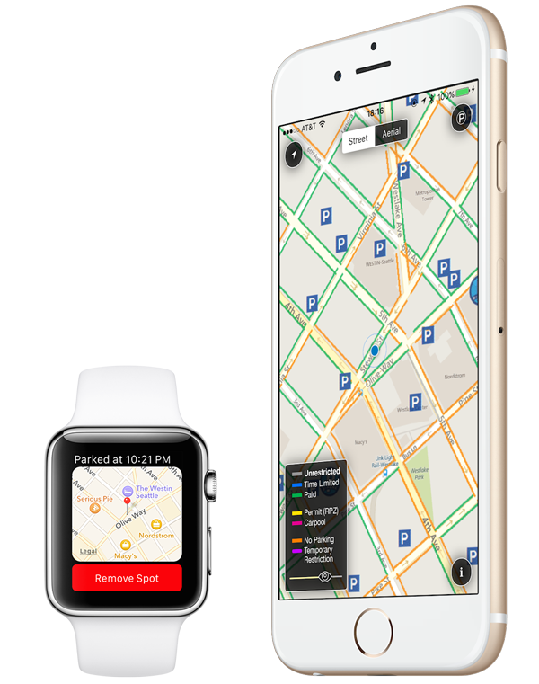

# Seattle Parking Map 
* This is an open source mirror of the Seattle Parking Map application from [Tap Light Software](http://www.taplightsoftware.com) that is available on the App Store.

## Build Instructions

1. You must install the [ArcGIS SDK](https://developers.arcgis.com/ios/ "ArcGIS SDK") on your Mac before building
2. The app has been tested against the framework version numbers listed in [Third Party Libraries](#Third Party Libraries)
3. Edit SPMConstants.h to provide the necessary API keys for ArcGIS, Flurry and Bing Maps 

### Considerations
* API keys for services & original design assets are stripped in the open source mirror
* The app integrates with the ArcGIS backend that SDOT uses to power their [online parking map](http://web6.seattle.gov/sdot/seattleparkingmap/)

## Testing
* Use the included .gpx files with Xcode's ability to simulate a location on device or simulator
* The application only works within the bounds of the Seattle metropolitan area, as defined by the SDOT ArcGIS server

## License
* Licensed under the MIT License. Please contact me if you have any questions, and be sure to consult with SDOT, the City of Seattle, and ArcGIS if you have questions about the restrictions on use of their data, services and SDKs in any possible commercial endeavours

## Third Party Libraries
* ArcGIS: 10.2.5
* Flurry: 7.3.0